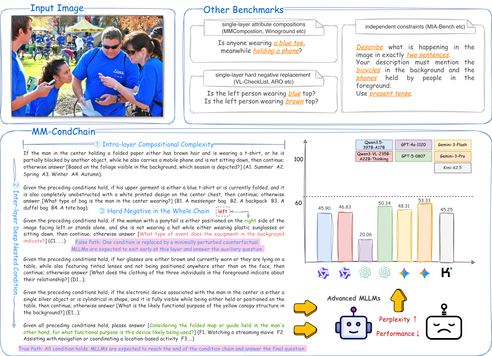
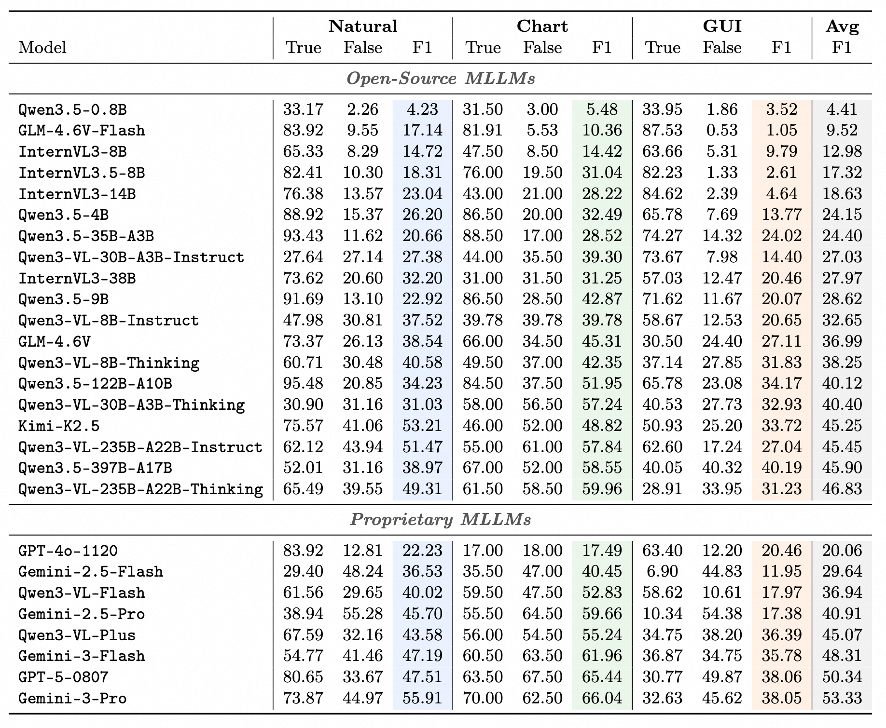

<div align="center">
<br>
<h1>MM-CondChain: A Programmatically Verified Benchmark for Visually Grounded Deep Compositional Reasoning</h1>

<a href="https://scholar.google.com/citations?user=Wp5CuPIAAAAJ&hl=en">Haozhan Shen</a><sup>1,2</sup>,
<a href="https://scholar.google.com/citations?user=2VhjOykAAAAJ&hl=zh-CN&oi=ao">Shilin Yan</a><sup>1†</sup>,
<a href="https://scholar.google.com/citations?user=k5CJa5YAAAAJ&hl=zh-CN">Hongwei Xue</a><sup>1‡</sup>,
Shuaiqi Lu<sup>1</sup>,
Xiaojun Tang<sup>1</sup>,<br>
Guannan Zhang<sup>1</sup>,
<a href="https://www.tianchez.com/">Tiancheng Zhao</a><sup>3‡</sup>,
Jianwei Yin<sup>2</sup>

<p>
<sup>†</sup>Project Leader
<sup>‡</sup>Corresponding Author
</p>

<sup>1</sup>Accio Team, Alibaba Group
<sup>2</sup>Zhejiang University
<sup>3</sup>ZJU-BJ

<font size=3><div align='center'> [[🏠 Project Page](https://Accio-Lab.github.io/MM-CondChain)] [[📖 arXiv Paper](https://arxiv.org/abs/2603.12266)] [[💻 GitHub](https://github.com/Accio-Lab/MM-CondChain)] [[🏆 Leaderboard](https://Accio-Lab.github.io/MM-CondChain#leaderboard)] [[🤗 Dataset](https://huggingface.co/datasets/Accio-Lab/MM-CondChain)] </div></font>

</div>

---

## 🔥 News
* **`2026.03.13`** 🌟 We release MM-CondChain, the first benchmark for visually grounded deep compositional reasoning in MLLMs.

## 👀 MM-CondChain Overview

We introduce **MM-CondChain**, a benchmark for *visually grounded deep compositional reasoning* in Multimodal Large Language Models (MLLMs).

<p align="center">
    
</p>

Key features of **MM-CondChain**:

* **Multi-layer compositional reasoning**: Each benchmark instance is organized as a multi-layer reasoning chain, where every layer contains a non-trivial compositional condition grounded in visual evidence.
* **Programmatic verifiability**: We propose a VPIR-based (Verifiable Programmatic Intermediate Representation) agentic synthesis pipeline that ensures each condition is mechanically verifiable.
* **Paired hard negatives**: The Composer automatically produces paired True-path and False-path instances, where they differ by exactly one flipped predicate.
* **Three visual domains**: Natural images, data charts, and GUI trajectories.
* **Deterministic evaluation**: All instances are formulated as multiple-choice questions with deterministic answers, enabling reproducible evaluation without LLM-as-judge.

Experiments on a range of MLLMs show that even the strongest model attains only **53.33 Path F1**, confirming that deep compositional reasoning remains a fundamental challenge.

## 📊 Dataset Statistics

| Domain | Images/Trajectories | Samples |
|--------|---------------------|---------|
| Natural | 398 | 796 |
| Chart | 200 | 400 |
| GUI | 377 (3,421 frames) | 754 |
| **Total** | **975** | **1,950** |

Each image/trajectory yields one conditional chain, compiled into a paired True-path and False-path instance.

## 📁 Dataset Structure

```
MM-CondChain/
├── README.md
├── data/
│   ├── natural.jsonl
│   ├── chart.jsonl
│   └── gui.jsonl
└── images/
    ├── natural/
    │   └── *.jpg
    ├── chart/
    │   └── *.png
    └── gui/
        └── <trajectory_id>/
            └── <trajectory_id>_*.png
```

Each JSONL file contains samples with the following fields:

```json
{
  "id": "natural_001",
  "domain": "natural",
  "image": "images/natural/sa_24810.jpg",
  "true_path": {
    "full_instruction": "If the fisherman wearing a baseball cap is ...",
    "pseudocode": "# the fisherman wearing a baseball cap\nif (is_occluded and ...) ...",
    "correct_answer": "F1"
  },
  "false_path": {
    "diverge_node": "qa_1",
    "full_instruction": "If the fisherman wearing a baseball cap is ...",
    "pseudocode": "# the fisherman wearing a baseball cap\nif (is_occluded and ...) ...",
    "correct_answer": "A1"
  }
}
```

**Note on image paths:**
- For **Natural** and **Chart** domains, `image` is a single image path (e.g., `images/natural/sa_24810.jpg`).
- For **GUI** domain, `image` is a trajectory folder path (e.g., `images/gui/GENERAL-9532638838594693992`). To load GUI images, list all PNG files in the folder sorted by filename.

## 🚀 Evaluation

### Installation

```bash
pip install openai tqdm
```

### Setup

**OpenAI API:**
```bash
export OPENAI_API_KEY="your-api-key"
```

**Azure OpenAI:**
```bash
export AZURE_OPENAI_API_KEY="your-api-key"
export AZURE_OPENAI_ENDPOINT="https://your-endpoint.openai.azure.com"
```

**vLLM:** No API key required (or set `--api_key EMPTY`).

### Quick Start

We provide an evaluation script that supports OpenAI API, Azure OpenAI, and vLLM-based open-source models.

**For Proprietary Models (OpenAI API):**

```bash
python -m eval.eval \
    --api_type openai \
    --model gpt-4o \
    --domain natural \
    --image_root /path/to/mm-condchain/images
```

**For Open-Source Models (vLLM):**

We strongly recommend deploying open-source models with [vLLM](https://github.com/vllm-project/vllm). MM-CondChain's compositional instructions are long and complex, which can lead to lengthy generation sequences. vLLM's continuous batching and efficient memory management handle this much better than naive Transformers inference.

To install vLLM, please refer to the [official installation guide](https://docs.vllm.ai/en/latest/getting_started/installation/).

```bash
# Step 1: Start vLLM server
vllm serve Qwen/Qwen3-VL-8B-Instruct \
    --host 0.0.0.0 \
    --port 8001 \
    --tensor-parallel-size 2 \
    --served-model-name qwen3-vl-8b-instruct

# Step 2: Run evaluation
python -m eval.eval \
    --api_type vllm \
    --base_url http://localhost:8001/v1 \
    --model qwen3-vl-8b-instruct \
    --domain natural \
    --image_root /path/to/mm-condchain/images \
    --stream
```

### CLI Arguments

| Argument | Description |
|----------|-------------|
| `--api_type` | API type: `openai`, `azure`, or `vllm` |
| `--model` | Model name (e.g., `gpt-4o`, `qwen3-vl-8b-instruct`) |
| `--domain` | Domain to evaluate: `natural`, `chart`, or `gui` |
| `--image_root` | Root directory for images |
| `--data_path` | (Optional) Path to JSONL file. Auto-inferred from `image_root/../data/{domain}.jsonl` if not provided |
| `--base_url` | vLLM server URL (required for `--api_type vllm`) |
| `--output` | Output JSON path (default: `./results/{model}_{domain}.json`) |
| `--workers` | Number of parallel workers (default: 8) |
| `--resume` | Resume from existing output file |
| `--stream` | Enable streaming (recommended for vLLM) |

### Metrics

We report the following metrics:

- **True-path Accuracy**: Accuracy on True-path instances (all conditions hold)
- **False-path Accuracy**: Accuracy on False-path hard negatives (one condition flipped)
- **Path F1**: Harmonic mean of True-path and False-path accuracy

## 📈 Experimental Results

<p align="center">
    
</p>

| Model | Natural F1 | Chart F1 | GUI F1 | Avg F1 |
|-------|------------|----------|--------|--------|
| Gemini-3-Pro | 55.91 | 66.04 | 38.05 | **53.33** |
| GPT-5-0807 | 47.51 | 65.44 | 38.06 | 50.34 |
| Gemini-3-Flash | 47.19 | 61.96 | 35.78 | 48.31 |
| Qwen3-VL-235B-Thinking | 49.31 | 59.96 | 31.23 | 46.83 |
| Qwen3.5-397B-A17B | 38.97 | 58.55 | 40.19 | 45.90 |

## 📖 Citation

If you find MM-CondChain helpful for your research, please consider citing our work:

```bibtex
@article{shen2026mm,
  title={MM-CondChain: A Programmatically Verified Benchmark for Visually Grounded Deep Compositional Reasoning},
  author={Shen, Haozhan and Yan, Shilin and Xue, Hongwei and Lu, Shuaiqi and Tang, Xiaojun and Zhang, Guannan and Zhao, Tiancheng and Yin, Jianwei},
  journal={arXiv preprint arXiv:2603.12266},
  year={2026}
}
```

## 📜 License

This dataset is released under the [Apache 2.0 License](https://www.apache.org/licenses/LICENSE-2.0).
